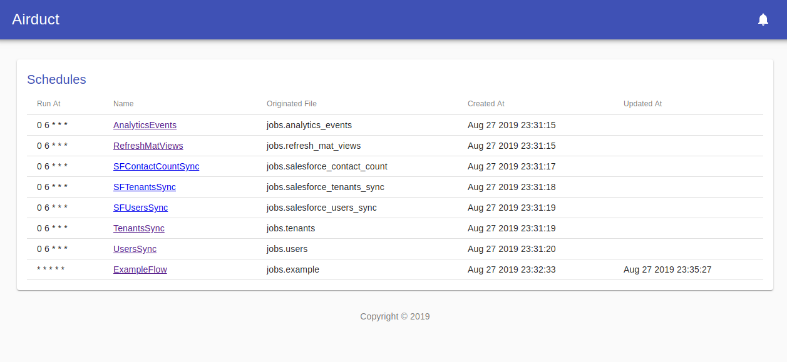

# airduct
Simple Pipeline Scheduler in Python



## Links

- [Github](https://github.com/alairock/airduct)
- [Documentation](https://airduct.readthedocs.io)

## Installing
    $ pip install airduct

or

    $ poetry add airduct

## Quickstart

Create a file and put into a folder/python-module.

```python
from airduct import schedule, task


schedule(
    name='ExampleFlow',
    run_at='* * * * *',
    flow=[
        task('e1f1'),
        [task('e1f2'), task('e1f3', can_fail=True)],
        [task('e1f4')]
    ]
)

async def e1f1():
    print('e1f1 - An async function!')

def e1f2():
    print('e1f2 - Regular functions work too')

async def e1f3():
    print('e1f3')

async def e1f4():
    print('e1f4')
```

Run: `$ airduct schedule --path /path/to/folder`

By default it uses a sqlite in-memory database. If using the in-memory database, it will also automatically run as a worker, in addition to a scheduler. If you wish to use a non in-memory sqlite database, you will need to also run a worker (could be on same box, or separate) See the documentation for more info.

